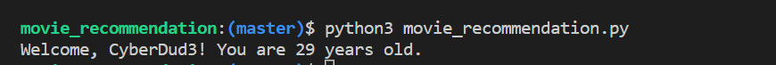
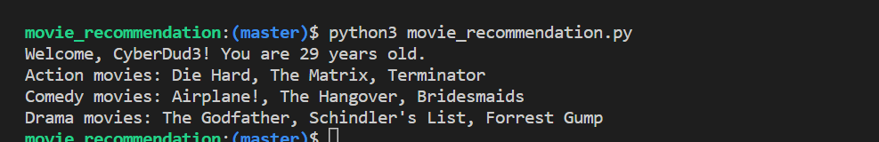

[🏠 Home ](../README.md) | [ Task ❓](./assignment.MD)

# Day 2: Variables and Data Types

This task involves defining the user's name and age variables, store movie genres and their respective movies in variables, and display them using formatted strings.

## Step 1: Create variables to store user's name and age

- In your Python file, you can create variables to store the user's name and age by using the assignment operator (=). For example:

    ```
    name = "CyberDud3"
    age = 29
    ```

## Step 2: Print a personalized message to the console based on the user's name and age.

- You can use string formatting to personalize the message that is printed to the console based on the user's name and age. For example:

    ```
    print("Welcome, {}! You are {} years old.".format(name, age))
    ```

- This will print a message like:

    

## Step 3: Create variables to store movie genres and a list of movies under each genre

- You can create variables to store the movie genres and lists of movies under each genre using Python lists. For example:

    ```
    action_movies = ["Die Hard", "The Matrix", "Terminator"]
    comedy_movies = ["Airplane!", "The Hangover", "Bridesmaids"]
    drama_movies = ["The Godfather", "Schindler's List", "Forrest Gump"]
    ```

## Step 4: Use string formatting to display the movie genres and lists of movies in a formatted way

- You can use string formatting again to display the movie genres and lists of movies in a formatted way. For example:

    ```
    print("Action movies: {}".format(", ".join(action_movies)))
    print("Comedy movies: {}".format(", ".join(comedy_movies)))
    print("Drama movies: {}".format(", ".join(drama_movies)))
    ```

- This will print messages like:

    

That's it for Day 2! You've created variables to store user's name, age, movie genres, and lists of movies under each genre. You've also used string formatting to personalize messages based on user's name and age, and to display the movie genres and lists of movies in a formatted way. Next, you can move on to Day 3 to start working with operators and expressions in Python.

<br>

## 🎉 CONGRATULATIONS! 🎉

<br>

[🏠 Home ](../README.md) | [ Task ❓](./assignment.MD)

